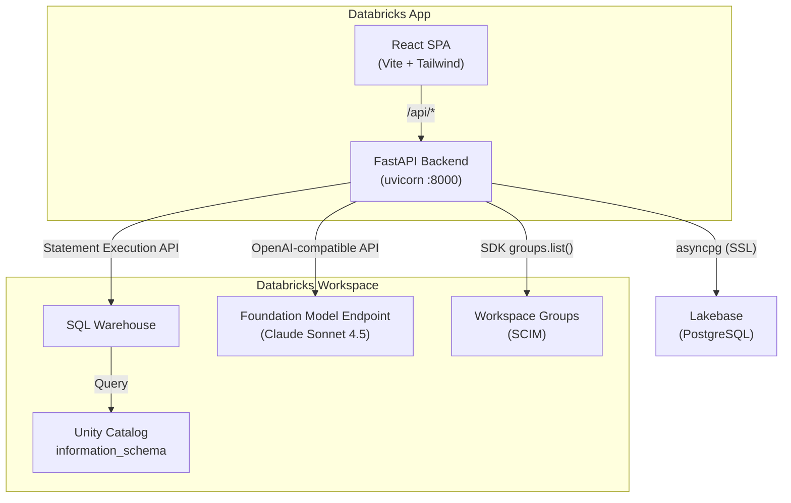
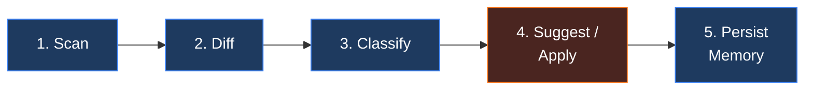
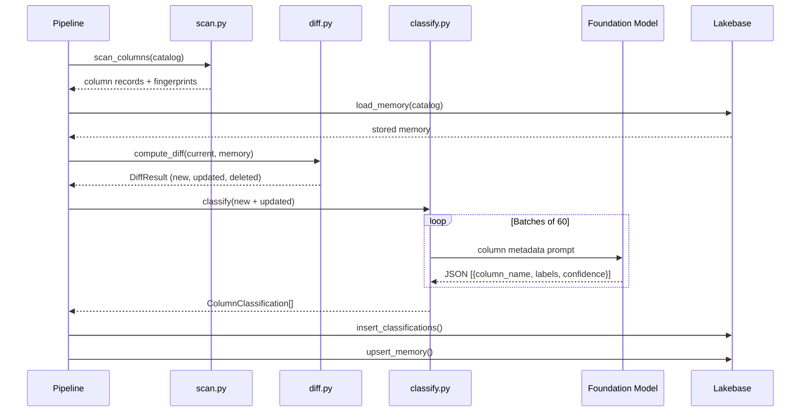
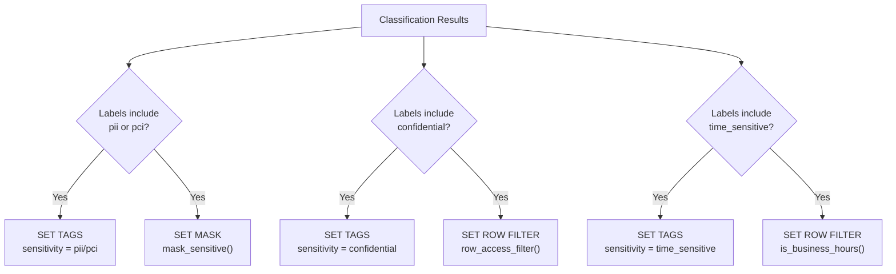
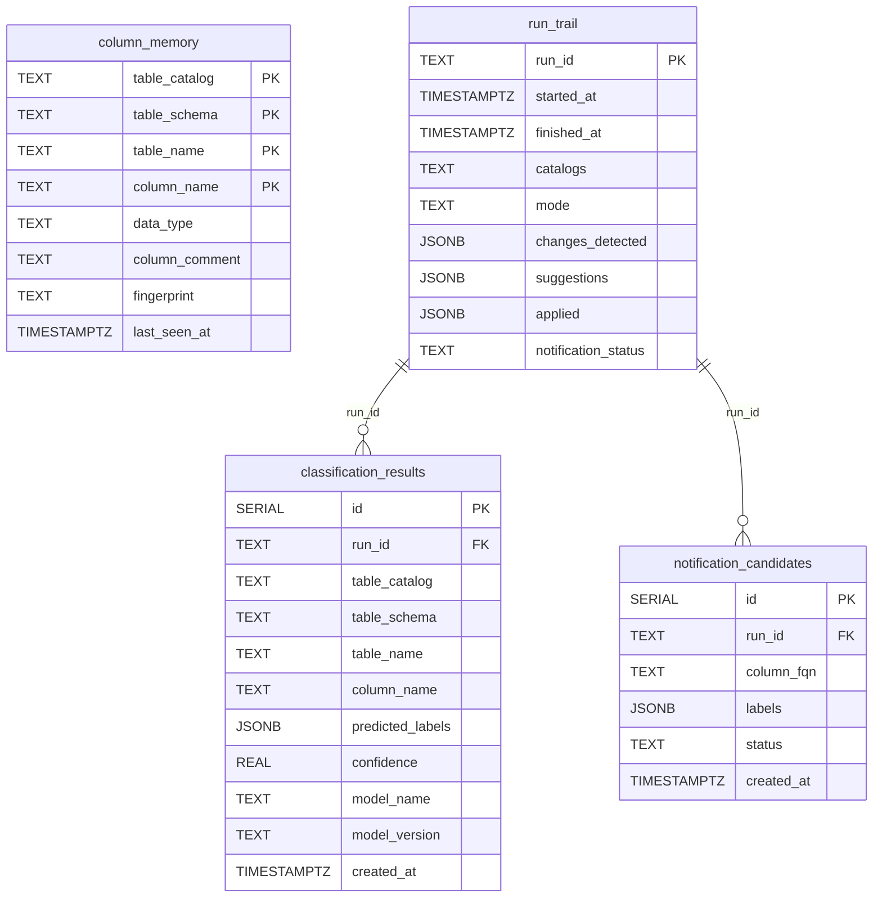
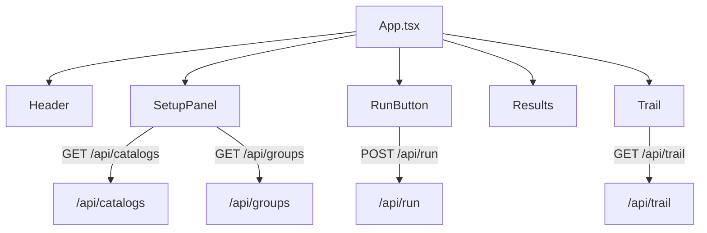

# Architecture

Finance Governance is a full-stack Databricks App composed of a **FastAPI backend**, a **React frontend**, and a **Lakebase (managed PostgreSQL) database** for persistent state. The backend communicates with Databricks workspace APIs to scan Unity Catalog metadata, classify column sensitivity with a Foundation Model, and optionally enforce governance policies.

## System Overview



## Governance Pipeline

Every run follows a five-stage pipeline. Only new and updated columns are sent to the LLM, keeping costs proportional to actual schema drift.



### Stage Details

| Stage | Module | What Happens |
|-------|--------|--------------|
| **Scan** | `server/governance/scan.py` | Queries `information_schema.columns` via a SQL warehouse. Builds a record per column with a SHA-256 fingerprint of its metadata (catalog, schema, table, name, type, comment). |
| **Diff** | `server/governance/diff.py` | Loads the stored `column_memory` from Lakebase and compares fingerprints. Produces three buckets: **new**, **updated**, and **deleted** columns. |
| **Classify** | `server/governance/classify.py` | Sends new + updated columns (in batches of 60) to the Foundation Model endpoint. The LLM returns sensitivity labels (`pii`, `pci`, `confidential`, `time_sensitive`, `public`) with confidence scores. |
| **Suggest / Apply** | `server/governance/tags_policies.py` | In **Suggest** mode, recommendations are returned to the UI. In **Agent** mode, the pipeline executes `ALTER TABLE` statements to apply tags, column masks, row filters, and time-based filters. |
| **Persist Memory** | `server/db.py` | Upserts the full current snapshot into `column_memory` so the next run only re-classifies genuinely changed columns. |

## Classification Flow



## Agent Mode — Policy Application

When the pipeline runs in Agent mode, the following governance actions are applied via SQL:



### UDF Details

The pipeline bootstraps a `governance_udfs` schema in each scanned catalog containing:

| UDF | Purpose |
|-----|---------|
| `mask_sensitive(val STRING)` | Returns the original value for members of `data_governance_admins`; otherwise returns `***REDACTED***` |
| `is_business_hours()` | Returns `true` during UTC 08:00–17:00, Monday–Friday |
| `row_access_filter()` | Returns `true` for members of `data_governance_admins` or any of the selected workspace groups |

## Data Model



## Frontend Components



| Component | Responsibility |
|-----------|---------------|
| **Header** | Application title and branding |
| **SetupPanel** | Catalog selector dropdown, Suggest/Agent mode toggle, workspace group checkboxes (Agent mode only) |
| **RunButton** | Triggers the pipeline via `POST /api/run`; shows spinner while running |
| **Results** | Displays scan stats, diff counts, color-coded classification badges, suggested/applied actions |
| **Trail** | Audit log of past runs with diff summaries and action counts |

## Project Layout

```
.
├── app.py                     # FastAPI entry point + SPA serving
├── app.yaml                   # Databricks App deployment config
├── requirements.txt           # Python dependencies
├── frontend/
│   ├── src/
│   │   ├── App.tsx            # Root component + state management
│   │   ├── api.ts             # Typed HTTP client for /api/*
│   │   ├── main.tsx           # React DOM entry
│   │   ├── index.css          # Tailwind base styles
│   │   └── components/
│   │       ├── Header.tsx
│   │       ├── SetupPanel.tsx
│   │       ├── RunButton.tsx
│   │       ├── Results.tsx
│   │       └── Trail.tsx
│   ├── package.json
│   └── vite.config.ts
├── server/
│   ├── config.py              # Databricks SDK + OAuth helpers
│   ├── db.py                  # Lakebase async layer (asyncpg)
│   ├── routes/
│   │   ├── runs.py            # POST /api/run, GET /api/runs
│   │   ├── catalogs.py        # GET /api/catalogs
│   │   ├── trail.py           # GET /api/trail
│   │   └── groups.py          # GET /api/groups
│   └── governance/
│       ├── pipeline.py        # Orchestration: scan → diff → classify → apply
│       ├── scan.py            # Unity Catalog column scanner
│       ├── diff.py            # Memory diffing
│       ├── classify.py        # LLM sensitivity classifier
│       ├── tags_policies.py   # Tag + mask + filter application
│       └── groups.py          # Workspace group listing
└── docs/
    ├── architecture.md        # This file
    ├── quickstart.md          # Setup and first-run guide
    └── configuration.md       # Environment and app.yaml reference
```
