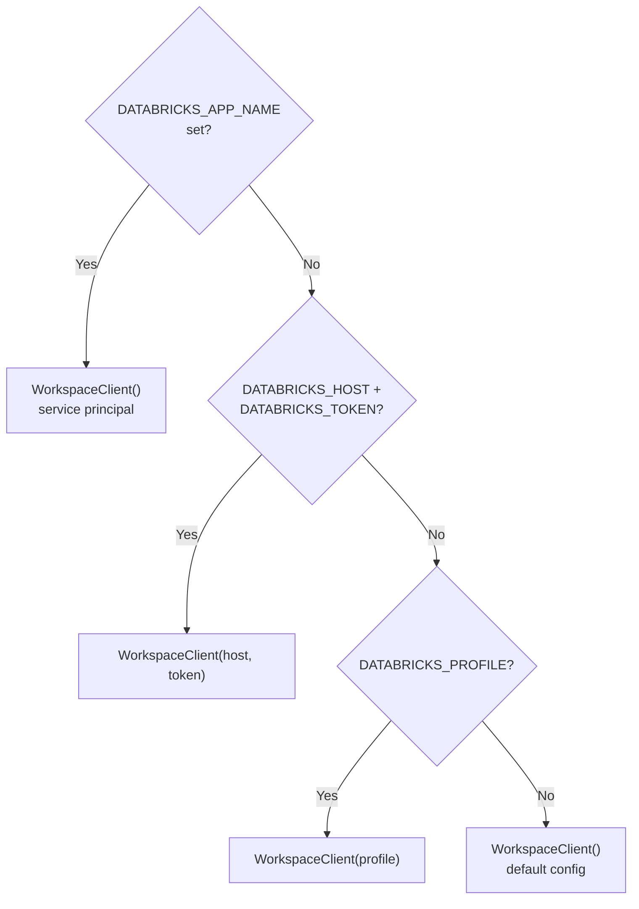

# Configuration

All runtime configuration is managed through environment variables, set either in `app.yaml` (for Databricks App deployment) or in a `.env` file / shell exports (for local development).

## app.yaml Reference

```yaml
command:
  - "python"
  - "-m"
  - "uvicorn"
  - "app:app"
  - "--host"
  - "0.0.0.0"
  - "--port"
  - "8000"

env:
  - name: PGHOST
    valueFrom: database
  - name: PGPORT
    valueFrom: database
  - name: PGDATABASE
    valueFrom: database
  - name: PGUSER
    valueFrom: database

  - name: SERVING_ENDPOINT
    value: databricks-claude-sonnet-4-5
```

The `command` block starts uvicorn on port 8000 — this is the only port Databricks Apps exposes.

Variables with `valueFrom: database` are injected automatically from the Lakebase database resource you attach during `databricks apps deploy`. You never set these manually for deployed apps.

## Environment Variables

### Database Connection (Lakebase)

| Variable | Source | Description |
|----------|--------|-------------|
| `PGHOST` | `valueFrom: database` | Lakebase instance hostname |
| `PGPORT` | `valueFrom: database` | PostgreSQL port (default `5432`) |
| `PGDATABASE` | `valueFrom: database` | Database name |
| `PGUSER` | `valueFrom: database` | Username (typically your email or service principal) |

The password is **not** set as an environment variable. The app obtains an OAuth token from the Databricks SDK at runtime and uses it as the PostgreSQL password. Tokens expire after approximately one hour; the `db.refresh_pool()` helper recreates the connection pool with a fresh token when needed.

### Databricks Authentication

| Variable | Required | Description |
|----------|----------|-------------|
| `DATABRICKS_APP_NAME` | Auto-set | Set automatically when running as a Databricks App. Triggers service-principal auth. |
| `DATABRICKS_HOST` | Local dev | Workspace URL (e.g., `https://my-workspace.cloud.databricks.com`) |
| `DATABRICKS_TOKEN` | Local dev | Personal access token for workspace API calls |
| `DATABRICKS_PROFILE` | Local dev | Alternative to host/token — a named CLI profile from `~/.databrickscfg` |

Authentication precedence:



### LLM / Serving Endpoint

| Variable | Default | Description |
|----------|---------|-------------|
| `SERVING_ENDPOINT` | `databricks-claude-sonnet-4-5` | The Foundation Model endpoint used for column classification. Must be available under **Serving > Foundation Model APIs** in your workspace. |

#### Supported Alternatives

Any OpenAI-compatible chat-completion endpoint served by Databricks will work. Common options:

| Endpoint | Notes |
|----------|-------|
| `databricks-claude-sonnet-4-5` | Default. High accuracy, pay-per-token. |
| `databricks-meta-llama-3-3-70b-instruct` | Open-source alternative. Lower cost. |
| Custom fine-tuned endpoint | Point to your own endpoint name if you've trained a specialized classifier. |

To change the model, update the `value` field in `app.yaml`:

```yaml
  - name: SERVING_ENDPOINT
    value: databricks-meta-llama-3-3-70b-instruct
```

## Connection Pool Settings

The asyncpg connection pool to Lakebase is configured in `server/db.py`:

| Setting | Value | Description |
|---------|-------|-------------|
| `min_size` | 2 | Minimum idle connections |
| `max_size` | 10 | Maximum concurrent connections |
| `ssl` | `require` | TLS is always required for Lakebase |

These values are suitable for the single-instance Databricks App deployment. If you run behind a load balancer or multiple replicas, increase `max_size` accordingly.

## Classification Tuning

The LLM classifier in `server/governance/classify.py` has two tunable constants:

| Setting | Value | Description |
|---------|-------|-------------|
| `BATCH_SIZE` | 60 | Number of columns sent per LLM request. Larger batches reduce API calls but increase per-request latency. |
| `temperature` | 0.1 | Low temperature for deterministic classification output. Increase if you want more varied results. |

### Sensitivity Labels

The classifier assigns from a fixed label set defined in `classify.py`:

| Label | Meaning | Governance Action (Agent Mode) |
|-------|---------|-------------------------------|
| `pii` | Personally identifiable information | Column mask + sensitivity tag |
| `pci` | Payment card data | Column mask + sensitivity tag |
| `confidential` | Business-sensitive data | Row filter (group-based) + sensitivity tag |
| `time_sensitive` | Time-bounded access data | Time-based row filter + sensitivity tag |
| `public` | Non-sensitive | No action taken |

A column can receive multiple labels (e.g., both `pii` and `confidential`).

## Required Permissions

The service principal or user identity running the app needs:

| Permission | Scope | Reason |
|------------|-------|--------|
| `USE CATALOG` | Target catalogs | Scanning `information_schema.columns` |
| `USE SCHEMA` | Target schemas | Scanning `information_schema.columns` |
| `SELECT` | `information_schema.columns` | Reading column metadata |
| `CREATE SCHEMA` | Target catalogs | Creating the `governance_udfs` schema |
| `CREATE FUNCTION` | `governance_udfs` schema | Creating governance UDFs |
| `ALTER TABLE` | Target tables | Applying tags, column masks, and row filters |
| SQL Warehouse access | Warehouse | Executing all SQL statements |
| Serving endpoint access | Foundation Model | Classifying columns via the LLM |

## API Endpoints

| Endpoint | Method | Description |
|----------|--------|-------------|
| `/api/health` | GET | Health check — returns `{"status": "ok"}` |
| `/api/catalogs` | GET | Lists Unity Catalog catalogs (excludes `system`) |
| `/api/groups` | GET | Lists workspace groups with member counts |
| `/api/run` | POST | Triggers a pipeline run. Body: `{"catalog": "...", "mode": "suggest|agent", "group_names": [...]}` |
| `/api/runs` | GET | Returns historical run records. Query param: `?limit=50` |
| `/api/runs/{run_id}/classifications` | GET | Returns classification details for a specific run |
| `/api/trail` | GET | Returns audit trail of past runs. Query param: `?limit=50` |

All endpoints are prefixed under `/api`. Any other path serves the React SPA from `frontend/dist/`.
