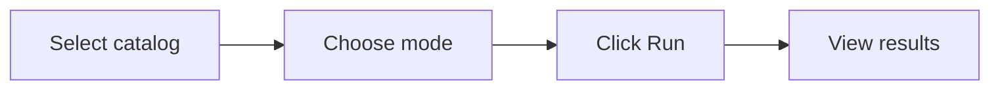

# Quick Start

Get AutoGov running in your Databricks workspace in under 10 minutes.

## Prerequisites

| Requirement | Minimum Version | Notes |
|-------------|-----------------|-------|
| Databricks CLI | v0.230+ | `databricks --version` to check |
| Node.js | 18+ | Required for building the frontend |
| npm | 9+ | Bundled with Node.js |
| Python | 3.11+ | For local development only |

Your Databricks workspace must have:

- **Unity Catalog** enabled with at least one catalog containing tables
- A **SQL Warehouse** in `RUNNING` or `STARTING` state
- The **Foundation Model endpoint** `databricks-claude-sonnet-4-5` available (or an alternative — see [Configuration](./configuration.md))

## Step 1 — Clone and Enter the Repository

```bash
git clone <repo-url> autogov
cd autogov
```

## Step 2 — Authenticate with Databricks

```bash
databricks auth login --host https://<your-workspace-url>
```

Verify with:

```bash
databricks warehouses list
```

You should see at least one warehouse.

## Step 3 — Build the Frontend

The FastAPI backend serves the React app from `frontend/dist/`. You must build it before deploying.

```bash
cd frontend
npm install
npm run build
cd ..
```

Confirm `frontend/dist/index.html` exists after the build completes.

## Step 4 — Create a Lakebase Database

The app stores all state (column memory, run history, classifications) in a Lakebase managed PostgreSQL database.

**Option A — Databricks UI:**

1. Navigate to **Catalog > Databases** in the workspace sidebar.
2. Click **Create database**.
3. Name it (e.g., `autogov_db`).

**Option B — CLI:**

```bash
databricks lakebase databases create \
  --name autogov_db \
  --catalog <your-catalog>
```

No manual schema setup is needed — the app auto-creates its tables on first startup.

## Step 5 — Create and Deploy the App

```bash
# Create the app
databricks apps create autogov \
  --description "Unity Catalog governance automation"

# Deploy with the Lakebase database attached
databricks apps deploy autogov \
  --source-code-path . \
  --resource database=<your-lakebase-database-name>
```

Replace `<your-lakebase-database-name>` with the name from Step 4.

This uploads your code, installs Python dependencies, injects the database connection, and starts the server.

## Step 6 — Verify

1. Open the **Apps** page in your workspace sidebar.
2. Find **autogov** and wait for status **Running**.
3. Click the app URL.

Or check via CLI:

```bash
curl https://<app-url>/api/health
# {"status":"ok"}
```

## Step 7 — Run Your First Scan



1. **Select a catalog** from the dropdown (or leave as "All catalogs").
2. **Choose a mode:**
   - **Suggest** — read-only; shows what *would* be applied
   - **Agent** — applies tags, masks, and filters directly in Unity Catalog
3. *(Agent mode only)* Select **workspace groups** for RBAC row filters.
4. Click **Run Scan** (Suggest) or **Run Scan & Apply** (Agent).

The results panel shows:
- Columns scanned and diff counts (new / updated / deleted)
- Classification suggestions with sensitivity labels and confidence scores
- Applied actions (Agent mode) or recommended actions (Suggest mode)

## Local Development (Optional)

For development without deploying to Databricks Apps:

```bash
# Create a Python virtual environment
python -m venv .venv
source .venv/bin/activate
pip install -r requirements.txt

# Set environment variables (or use a .env file)
export DATABRICKS_HOST=https://<workspace-url>
export DATABRICKS_TOKEN=<your-pat>
export PGHOST=<lakebase-host>
export PGPORT=5432
export PGDATABASE=<db-name>
export PGUSER=<your-email>
export SERVING_ENDPOINT=databricks-claude-sonnet-4-5

# Run the frontend dev server (in a separate terminal)
cd frontend && npm run dev

# Start the backend
uvicorn app:app --host 0.0.0.0 --port 8000 --reload
```

When running locally, authentication to Lakebase uses a Databricks OAuth token obtained from the SDK. Make sure your Databricks CLI profile or host/token pair is configured.

## Next Steps

- See [Configuration](./configuration.md) for all environment variables and `app.yaml` options
- See [Architecture](./architecture.md) for how the pipeline, data model, and components fit together
